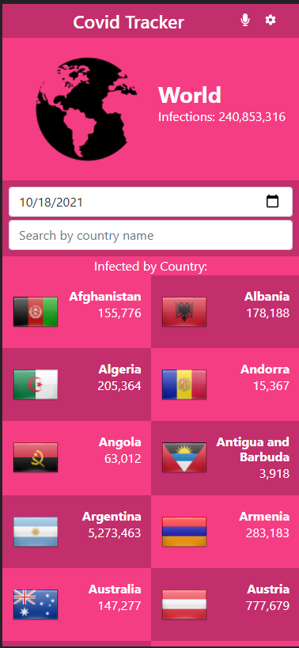
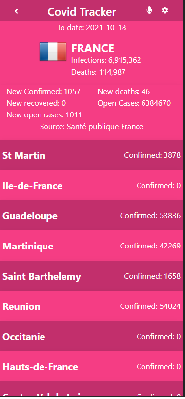

# Covid Tracker(For cellphone only)

App that allows you to keep track of the covid-19 pandemic by country and by date. You can check information by contry and some countries contain information for city. The App contain a easy way to find a country with a search input and also an option to change the date.

The app consist of 2 pages. Home that shows you all the countries and details page that shows each country and city information. The app design is meant for cellphones.

Original design idea by: [Nelson Sakwa on Behance](https://www.behance.net/sakwadesignstudio)

Flag pictures are from website [www.countryflags.io](https://www.countryflags.io/)

  

## Built With

- JavaScript
- HTML & CSS
- Bootstrap
- Webpack
- Jest testing framework
- Git and Github pages
- VSCode
- Linter Checkers

## Deployment Live Demo

Deployed with Heroku
  - [Live Demo](https://jaarcovidtracker.herokuapp.com/)

## Getting Started

To get a local copy up and running follow these simple example steps.

### Prerequisites

- IDE to edit and run the code (We use Visual Studio Code 🔥).
- [Node.js](https://nodejs.org/en/download/) already downloaded.

### Install

To get a local copy up and running follow these simple example steps.
- Open terminal
- Clone this project using the command
```
git clone https://github.com/JAAR91/covid-tracker.git
```
- Select the folder
```
cd covid-tracker
```
- To install all project dependencies run:
```
npm install
```
- To start the local server run:
```
npm start
```

### Install
To run all the test, type on the terminal:
```
npm run test
```

## Authors 👤 

👨‍💻 **Jose Alberto Arriaga Ramos**

- GitHub: [@jaarkira](https://github.com/jaarkira )
- Twitter: [@91_jaar](https://twitter.com/91_jaar )
- LinkedIn: [Jose Arriaga](https://www.linkedin.com/in/jaar/)


## 🤝 Contributing

Contributions, issues, and feature requests are welcome!

Feel free to check the [issues page](https://github.com/DanSam5K/Webflix-Index/issues).

## Show your support

Give a ⭐️ if you like this project!


## Acknowledgments

- Hat tip to anyone whose code was used 🔰
- Inspiration 💘
- Microverse program ⚡
- Our standup team 🏹
- Our family's support 🙌

## 📝 License

This project is [MIT](./LICENSE) licensed.
